# AutoRAG Pipeline: GPU-Accelerated Q&A with Standard RAG

A production-ready pipeline for extracting high-quality Q&A pairs from technical documentation and evaluating RAG performance against base models.

## 🎯 **What This Does**

1. **📄 Extracts Q&A pairs** from PDF manuals using a 3×3 matrix approach (difficulty × style)
2. **🔍 Builds vector store** with FAISS for semantic search and retrieval
3. **⚖️ Compares performance** between Standard RAG and Base Model approaches
4. **🎸 Demonstrates capabilities** with real amplifier questions
5. **📊 Generates training datasets** from high-quality Q&A pairs

## 🏗️ **Pipeline Architecture**

```mermaid
flowchart TD
    A[📄 PDF Manuals] --> B[🎯 3×3 Q&A Generation<br/>Difficulty × Style Matrix]
    B --> C[🔍 Q&A Selection<br/>Top 50 Quality Pairs]
    C --> D[📚 FAISS Vector Store]
    
    D --> E1[🔹 Standard RAG<br/>Answer Embeddings + Retrieval]
    D --> E2[🧠 Base Model<br/>No Retrieval Context]
    
    E1 --> F[📊 Performance Comparison]
    E2 --> F
    F --> G[🎸 Live Demonstration]
    F --> H[📈 Training Dataset]
```



## ⚡ **Key Features**

- **GPU-Accelerated**: Optimized for NVIDIA L40S with 47GB VRAM
- **Production Ready**: GitHub Actions pipeline with Machine.dev runners  
- **Systematic Evaluation**: BERT F1, semantic similarity, quality retention metrics
- **Real Demonstrations**: 10 practical amplifier questions with side-by-side comparisons
- **Simple Architecture**: Standard RAG approach proven effective for technical documentation

## 🚀 **Quick Start**

### Prerequisites
- Python 3.10+
- CUDA-capable GPU (recommended)
- PDF manuals for Q&A extraction

### Installation
```bash
# Install dependencies
uv pip install -r requirements-hf.txt --system
uv pip install -r requirements-domain-eval.txt --system

# Verify FAISS-GPU installation
python -c "import faiss; print('FAISS GPU available:', hasattr(faiss, 'StandardGpuResources'))"
```

### Usage

```bash
# 1. Generate Q&A pairs from PDF
python cli_pdf_qa.py your_manual.pdf \
  --output outputs/qa_pairs.jsonl \
  --model meta-llama/Meta-Llama-3-8B-Instruct \
  --difficulty-levels basic,intermediate,advanced

# 2. Select top quality pairs  
python qa_pair_selector.py \
  --qa-artifacts-dir outputs \
  --output-dir rag_input \
  --top-k 50

# 3. Build vector store
python qa_faiss_builder.py \
  --qa-pairs-file rag_input/selected_qa_pairs.json \
  --output-dir rag_store \
  --embedding-model all-MiniLM-L6-v2

# 4. Evaluate Standard RAG
python qa_autorag_evaluator.py \
  --qa-pairs-file rag_input/selected_qa_pairs.json \
  --qa-faiss-index rag_store/qa_faiss_index.bin \
  --qa-metadata rag_store/qa_metadata.json \
  --output-dir autorag_results/standard_rag

# 5. Evaluate Base Model (no RAG)
python qa_base_model_evaluator.py \
  --qa-pairs-file rag_input/selected_qa_pairs.json \
  --output-dir autorag_results/base_model

# 6. Compare performance
python rag_vs_base_comparison.py \
  --standard-results autorag_results/standard_rag \
  --base-results autorag_results/base_model \
  --output-file autorag_results/comparison_report.json

# 7. Run demonstration
python rag_demo_questions.py \
  --qa-faiss-index rag_store/qa_faiss_index.bin \
  --qa-metadata rag_store/qa_metadata.json \
  --output-file autorag_results/demonstration.json
```

## 📊 **Expected Results**

Based on actual technical documentation evaluation:

| Metric | Base Model | Standard RAG | RAG Advantage |
|--------|------------|--------------|---------------|
| BERT F1 Score | 0.864 | 0.843 | -2.5% (slight trade-off) |
| Semantic Similarity | 0.756 | 0.869 | +15.0% (better) |
| Quality Retention | 76.0% | 88.0% | +15.8% (much more consistent) |
| Generation Speed | 12.6s | 6.2s | +51% faster |

**Key Insight**: RAG trades minimal quality (-2.5%) for significantly better consistency (+15.8%) and 2× faster generation, making it ideal for production use.

## 🔧 **Configuration**

### Model Settings
- **Language Model**: `meta-llama/Meta-Llama-3-8B-Instruct`
- **Embedding Model**: `all-MiniLM-L6-v2` (384 dimensions)
- **Vector Store**: FAISS IndexFlatIP (cosine similarity)
- **Context Window**: 8K tokens

### Q&A Generation Matrix
- **Difficulty Levels**: Basic, Intermediate, Advanced
- **Generation Styles**: Conservative, Balanced, Creative  
- **Output**: 9 different Q&A generation approaches

## 📁 **Output Structure**

```
autorag_results/
├── standard_rag/
│   └── qa_rag_evaluation_report.json
├── base_model/
│   └── qa_base_model_evaluation_report.json
├── rag_vs_base_comparison.json
├── rag_demonstration.json
└── high_quality_pairs.jsonl

rag_store/
├── qa_faiss_index_cpu.bin     # CPU-compatible version
├── qa_faiss_index_gpu.bin     # GPU-accelerated version  
├── qa_faiss_index.bin         # Default (CPU) version
├── qa_metadata.json
└── model_info.json
```

## 🎸 **Demonstration Questions**

The pipeline includes 10 realistic amplifier questions for demonstration:

1. "What is the output impedance of the UAFX Ruby 63 amplifier?"
2. "How do you connect the amplifier to a speaker cabinet?"
3. "What is the maximum power output of this amplifier?"
4. "How do I adjust the gain settings on the amplifier?"
5. "What type of tubes does the amplifier use?"
6. "How do I troubleshoot if the amplifier has no sound output?"
7. "What are the dimensions and weight of the amplifier?"
8. "Can I use this amplifier with different impedance speakers?"
9. "What is the frequency response range of the amplifier?"
10. "How do I properly ground the amplifier for safety?"

## 🤖 **GitHub Actions Pipeline**

The complete pipeline runs automatically on GPU runners:

```yaml
name: PDF Q&A Standard RAG Pipeline
on:
  push:
    paths: ['pdfs/**', 'qa_extraction_lib/**']
  workflow_dispatch:
```

**Pipeline Steps**:
1. Q&A Generation (3×3 matrix permutations)
2. Quality Selection & Vector Store Building  
3. Standard RAG Evaluation
4. Base Model Evaluation
5. Performance Comparison
6. Live Demonstration
7. Training Dataset Generation

## 📈 **Use Cases**

### Choose Standard RAG When:
- Domain-specific accuracy is critical
- Working with technical documentation
- Need to cite specific sources
- Factual correctness is more important than speed

### Choose Base Model When:
- Speed is more important than precision
- General knowledge queries
- Creative or open-ended tasks
- Simple deployment requirements

## 🎯 **Next Steps**

1. **Deploy for Production**: Use the generated FAISS index for real-time Q&A
2. **Fine-tune Models**: Use `high_quality_pairs.jsonl` for domain-specific training
3. **Scale to Multiple Domains**: Expand beyond audio equipment manuals
4. **Optimize Inference**: Implement caching and batch processing for production

## 📚 **Available Documentation**

- [Q&A Generation Engine](docs/cli_pdf_qa.md) - PDF extraction and Q&A generation
- [Quality-Based Selection](docs/qa_pair_selector.md) - Multi-metric quality assessment  
- [Domain Evaluation](docs/domain_eval_gpu.md) - Domain-specific expertise measurement

## 🛠️ **Development**

This project follows the development principles in `MANIFESTO.md`:
- Poetry for dependency management
- Comprehensive logging and testing
- Single responsibility principle
- Quality over speed approach