# 🎸 AutoRAG Audio Equipment Q&A Pipeline

[](https://github.com)
[](https://python.org)
[](https://pytorch.org)
[](https://huggingface.co)

> **GPU-Accelerated Q&A Extraction and RAG Evaluation Pipeline for Audio Equipment Documentation**

Transform audio equipment manuals into high-quality training datasets through automated Q&A generation, FAISS vector indexing, and RAG-enhanced evaluation using Llama-3-8B-Instruct.

## 🚀 **What This Pipeline Does**

This repository implements a complete **AutoRAG (Automated Retrieval-Augmented Generation)** pipeline that:

1. **📄 Extracts Q&A pairs** from audio equipment PDFs using GPU-accelerated LLM processing
2. **🎯 Generates 9 matrix combinations** (3 difficulty levels × 3 creativity styles) 
3. **🔍 Builds vector stores** with GPU-optimized FAISS indexing
4. **⚡ Evaluates RAG performance** against base model responses
5. **📊 Produces domain-specific insights** for audio equipment knowledge
6. **🎓 Generates training datasets** ready for fine-tuning

---

## 🏗️ **Pipeline Architecture**

```mermaid
graph LR
    A[📄 Audio Manual PDF] --> B[🎸 Q&A Generation<br/>Matrix 3×3]
    B --> C[🔍 Top-K Selection]
    C --> D[🧠 FAISS Vector Store]
    D --> E[⚡ RAG Evaluation]
    E --> F[📊 Domain Analysis]
    F --> G[🎓 Training Dataset]
    
    style A fill:#f9d71c
    style G fill:#27ae60
```



### **3×3 Matrix Generation Strategy**

| Difficulty | High Creativity (0.9) | Balanced (0.7) | Conservative (0.3) |
|------------|----------------------|-----------------|-------------------|
| **Basic** | Broad, creative questions | Standard questions | Focused, literal |
| **Intermediate** | Complex scenarios | Technical details | Specific procedures |
| **Advanced** | Expert-level analysis | Professional insights | Precise specifications |

---

## 🛠️ **Quick Start**

### **Prerequisites**
- **GPU Required**: NVIDIA GPU with CUDA support (L40S recommended)
- **Python**: 3.9+
- **Storage**: ~10GB for models + datasets

### **Installation**
```bash
# Clone the repository
git clone <repository-url>
cd autorag

# Install Poetry (if not already installed)
curl -sSL https://install.python-poetry.org | python3 -

# Install dependencies with Poetry
poetry install

# Set up Hugging Face token
export HF_TOKEN="your_hugging_face_token_here"
```

### **Run the Complete Pipeline**
```bash
# Trigger the full AutoRAG pipeline via GitHub Actions
gh workflow run pdf-qa-autorag.yaml \
  --field input_file="pdfs/UAFX_Ruby_63_Top_Boost_Amplifier_Manual.pdf" \
  --field model_name="meta-llama/Meta-Llama-3-8B-Instruct" \
  --field top_k_selection="50"
```

Or run components individually:

```bash
# 1. Generate Q&A pairs (example: basic difficulty, balanced creativity)
python cli_pdf_qa.py \
  pdfs/UAFX_Ruby_63_Top_Boost_Amplifier_Manual.pdf \
  --output outputs/qa_basic_balanced.jsonl \
  --difficulty-levels basic \
  --temperature 0.7 --top-p 0.9

# 2. Select best pairs
python qa_pair_selector.py \
  --qa-artifacts-dir outputs \
  --output-dir rag_input \
  --top-k 50

# 3. Build vector store
python qa_faiss_builder.py \
  --qa-pairs-file rag_input/selected_qa_pairs.json \
  --output-dir rag_store

# 4. Run RAG evaluation
python qa_autorag_evaluator.py \
  --qa-pairs-file rag_input/selected_qa_pairs.json \
  --qa-faiss-index rag_store/qa_faiss_index_gpu.bin \
  --output-dir autorag_results

# 5. Domain-specific evaluation
python domain_eval_gpu.py \
  --config audio_equipment_domain_questions.json \
  --results-dir outputs
```

---

## 📁 **Project Structure**

```
autorag/
├── 🎸 pdfs/                                    # Audio equipment manuals
│   └── UAFX_Ruby_63_Top_Boost_Amplifier_Manual.pdf
├── ⚙️  qa_extraction_lib/                      # Core extraction library
│   ├── pdf_generator.py                       # PDF text processing
│   ├── prompt_manager.py                      # LLM prompt templates
│   └── text_processing.py                     # Text chunking & preprocessing
├── 🔧 Pipeline Scripts
│   ├── cli_pdf_qa.py                         # Main Q&A generator (9 matrix combinations)
│   ├── qa_pair_selector.py                   # Top-K selection algorithm
│   ├── qa_faiss_builder.py                   # GPU FAISS index builder
│   ├── qa_autorag_evaluator.py               # RAG vs Base model evaluation
│   ├── training_dataset_generator.py          # High-quality dataset generator
│   └── domain_eval_gpu.py                    # Audio equipment domain evaluator
├── 🎯 Configuration
│   ├── audio_equipment_domain_questions.json  # Domain-specific evaluation config
│   └── pyproject.toml                         # Poetry dependencies and project config
├── 🤖 .github/workflows/
│   └── pdf-qa-autorag.yaml                   # Complete CI/CD pipeline
└── 📊 Output Directories (auto-created)
    ├── outputs/           # Generated Q&A pairs (9 matrix files)
    ├── rag_input/         # Selected pairs + metadata
    ├── rag_store/         # FAISS indices + embeddings
    └── autorag_results/   # Evaluation reports + training datasets
```

---

## 🎯 **Key Features**

### **🚀 GPU-Accelerated Processing**
- **FAISS GPU indexing** for lightning-fast similarity search
- **Llama-3-8B-Instruct** with optional 8-bit quantization
- **Batch processing** with parallel GPU utilization
- **Hybrid retrieval** (Dense + BM25 sparse matching)

### **📊 Comprehensive Evaluation**
- **RAG vs Base Model** performance comparison
- **BERT-Score semantic evaluation** 
- **Domain relevance scoring** for audio equipment knowledge
- **Uncertainty detection** for out-of-domain questions

### **🎓 Training-Ready Outputs**
- **High-quality Q&A pairs** filtered by semantic similarity
- **JSONL format** compatible with popular training frameworks
- **Metadata preservation** (difficulty, creativity, source tracking)
- **Quality metrics** for dataset curation

---

## 🔬 **Evaluation Metrics**

The pipeline provides multi-dimensional evaluation:

| Metric Category | Measures | Good For |
|----------------|----------|----------|
| **Semantic Quality** | BERT-Score F1, Precision, Recall | Answer accuracy |
| **Domain Relevance** | Audio equipment term frequency | Specialization |
| **Response Length** | Word count, token count | Completeness |
| **Uncertainty** | "I don't know" phrase detection | Confidence |
| **Retrieval Quality** | Dense + sparse score combination | Context relevance |

---

## 🎸 **Audio Equipment Domain**

Specifically tuned for **guitar amplifiers and effects**:

- **Domain Terms**: amplifier, guitar, tone, distortion, overdrive, gain, EQ, tube, preamp, etc.
- **Question Categories**: Technical specifications, setup procedures, troubleshooting, comparisons
- **Knowledge Areas**: Impedance matching, tube saturation, power handling, signal processing

---

## 📚 **Detailed Documentation**

For in-depth technical details on each component:

### Component Documentation
- **[Q&A Generation](docs/cli_pdf_qa.md)** - PDF processing and LLM-based Q&A extraction
- **[Quality Selection](docs/qa_pair_selector.md)** - Multi-metric quality assessment and filtering  
- **[Vector Store](docs/qa_faiss_builder.md)** - GPU-accelerated FAISS indexing and hybrid search
- **[RAG Evaluation](docs/qa_autorag_evaluator.md)** - Base vs RAG performance comparison
- **[Training Dataset](docs/training_dataset_generator.md)** - Quality-filtered training data generation
- **[Domain Evaluation](docs/domain_eval_gpu.md)** - Domain expertise and specialization analysis

### Architecture Overview  
- **[Pipeline Architecture](docs/architecture.md)** - Complete system design and data flow

Each component document includes technical implementation details, configuration options, performance characteristics, and use cases.

---

## 🚀 **Advanced Usage**

### **Custom PDF Processing**
```bash
# Process your own audio equipment manual
python cli_pdf_qa.py your_manual.pdf \
  --chunk-size 600 \
  --batch-size 4 \
  --difficulty-levels basic intermediate \
  --quantize  # Enable for lower GPU memory
```

### **Fine-tune Selection Criteria**
```bash
# More aggressive filtering
python qa_pair_selector.py \
  --qa-artifacts-dir outputs \
  --top-k 25 \
  --min-quality-threshold 0.7
```

### **Custom Domain Configuration**
Edit `audio_equipment_domain_questions.json` to:
- Add new domain terms
- Create custom evaluation questions  
- Modify confidence templates

---

## 🎯 **Expected Results**

After running the complete pipeline, expect:

- **~500-1000 Q&A pairs** from a typical amplifier manual
- **50+ high-quality pairs** selected for RAG evaluation
- **GPU FAISS index** with sub-millisecond query times
- **Domain relevance scores** typically 0.6-0.8 for in-domain questions
- **BERT-Score improvements** of 0.1-0.3 F1 with RAG vs base model
- **Training dataset** ready for fine-tuning specialized audio equipment models

---

## 🤝 **Contributing**

This pipeline is designed for **audio equipment domain specialization**. To adapt for other domains:

1. **Replace PDF**: Add your domain-specific documentation to `pdfs/`
2. **Update domain config**: Modify `audio_equipment_domain_questions.json`
3. **Adjust prompts**: Edit templates in `qa_extraction_lib/prompt_manager.py`
4. **Update workflow**: Change default paths in `.github/workflows/pdf-qa-autorag.yaml`

---

## 📝 **License**

This project demonstrates advanced RAG pipeline techniques for domain-specific knowledge extraction. Built with modern ML tools including PyTorch, Transformers, FAISS, and Llama-3.

**Key Technologies**: Python 3.9+, PyTorch 2.1+, Transformers 4.42+, FAISS GPU, Sentence-Transformers, BERT-Score

---

*🎸 Ready to amplify your audio equipment knowledge with AI? Let's rock! 🤘*