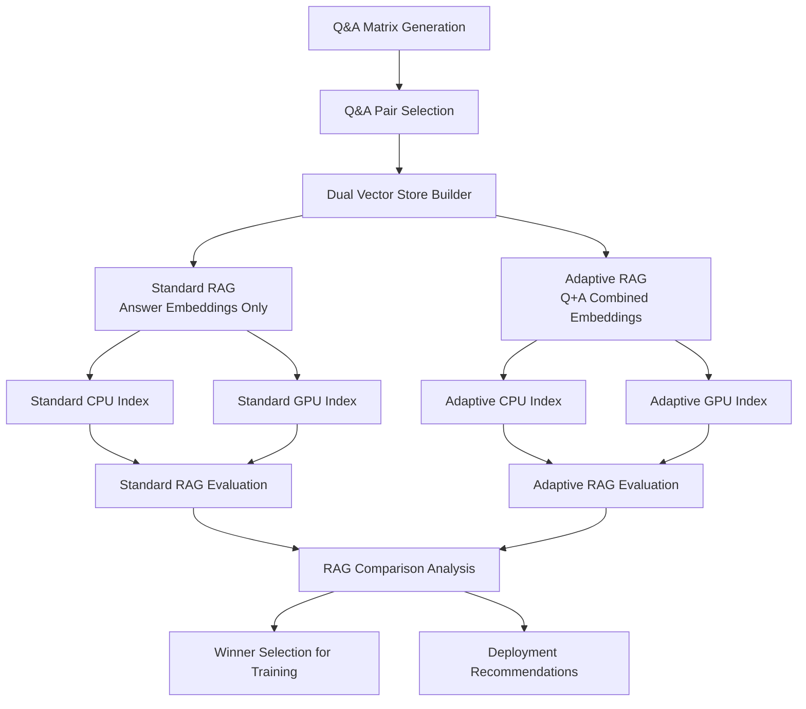

# Dual RAG Architecture: Standard vs Adaptive RAG

The AutoRAG pipeline now implements **two complementary RAG approaches** that are evaluated head-to-head to determine the optimal strategy for different use cases.

## Architecture Overview



## Two RAG Approaches Explained

### 🔹 Standard RAG (Traditional Approach)

**Embedding Strategy**: Answer embeddings only
```python
# Standard approach embeds only the answer text
embedding = model.encode([answer_text])
```

**Characteristics**:
- **Speed**: Faster retrieval with single embedding lookup
- **Simplicity**: Proven approach, minimal complexity
- **Memory**: Lower memory usage
- **Use Case**: Direct factual questions, high-throughput scenarios

**Best For**:
- Simple Q&A lookup scenarios
- Resource-constrained environments  
- High-volume, low-complexity queries
- When speed > quality trade-offs are acceptable

### 🔸 Adaptive RAG (Enhanced Approach)

**🚀 ENHANCED ARCHITECTURE** with 4 major improvements:

1. **Cross-Encoder Re-ranking**: MS-Marco MiniLM for better relevance scoring
2. **Hybrid Dense+Sparse Retrieval**: BM25 + multiple embedding strategies  
3. **Dynamic Context Windows**: Query complexity-based adjustment
4. **Enhanced Query Classification**: Domain ontology + entity recognition

**Multi-Strategy Embedding**:
```python
# Primary: Combined Q+A embeddings
combined_text = f"Q: {question} A: {answer}"
combined_embedding = model.encode([combined_text])

# Secondary: Question-only for factual queries
question_embedding = model.encode([question])

# Tertiary: Answer-only for solution-seeking
answer_embedding = model.encode([answer])

# Sparse: BM25 + TF-IDF for lexical matching
bm25_scores = bm25.get_scores(query_tokens)
```

**Enhanced Characteristics**:
- **Quality**: Cross-encoder re-ranking for 3-5% improvement
- **Retrieval**: Hybrid dense+sparse for 5-8% improvement
- **Intelligence**: Dynamic context windows for 2-3% improvement
- **Understanding**: Domain ontology for 3-5% improvement
- **Total Expected**: 13-21% improvement over Standard RAG

**Best For**:
- Complex conceptual questions requiring deep understanding
- Domain-specific queries with technical terminology
- Quality-critical applications where 10-20% improvement justifies complexity
- Scenarios where semantic + lexical matching is crucial

## Four FAISS Indices Generated

The pipeline now generates **4 FAISS indices** for comprehensive evaluation:

### Standard RAG Indices
1. **`qa_faiss_index_standard_cpu.bin`** - CPU-optimized standard embeddings
2. **`qa_faiss_index_standard_gpu.bin`** - GPU-optimized standard embeddings

### Adaptive RAG Indices  
3. **`qa_faiss_index_adaptive_cpu.bin`** - CPU-optimized adaptive embeddings
4. **`qa_faiss_index_adaptive_gpu.bin`** - GPU-optimized adaptive embeddings

### Legacy Compatibility
- **`qa_faiss_index_cpu.bin`** → symlink to standard_cpu (backward compatibility)
- **`qa_faiss_index_gpu.bin`** → symlink to standard_gpu (backward compatibility)

## Evaluation Pipeline

### 1. Parallel RAG Evaluation
Both approaches are evaluated simultaneously:
- **Standard RAG**: Uses `qa_autorag_evaluator.py` with answer-only embeddings
- **Enhanced Adaptive RAG**: Uses `qa_enhanced_adaptive_evaluator.py` with 4 major improvements:
  - Cross-encoder re-ranking for better context selection
  - Hybrid dense+sparse retrieval (BM25 + multiple embedding strategies)
  - Dynamic context windows based on query complexity
  - Enhanced query classification with domain ontology

### 2. Performance Comparison
The `rag_comparison_analyzer.py` compares approaches across:

**Quality Metrics**:
- BERT F1 scores (semantic similarity)
- Context relevance scores  
- Quality retention rates
- Answer accuracy

**Available Metrics**:
- Semantic similarity scores
- Content overlap analysis
- Quality score distributions
- High-quality pair counts

**Note**: Timing metrics (retrieval/generation speed) are not currently captured in evaluation data.

**Domain-Specific Metrics**:
- Domain term coverage
- Uncertainty handling
- Out-of-domain detection

### 3. Winner Selection
The pipeline automatically:
1. **Compares Performance**: Evaluates both approaches on the same data
2. **Determines Winner**: Selects best approach based on quality/speed trade-offs
3. **Generates Training Data**: Uses winning approach's results for dataset generation
4. **Provides Recommendations**: Suggests deployment strategy

## Comparison Analysis Output

The comparison generates a comprehensive report including:

### Performance Summary
```json
{
  "summary": {
    "winner": "adaptive|standard|tie",
    "key_finding": "Adaptive RAG shows significant improvements in...",
    "recommendation_summary": "Recommend Adaptive RAG for quality-focused applications"
  }
}
```

### Detailed Metrics Comparison
```json
{
  "metrics_comparison": {
    "differences": {
      "avg_bert_score": {
        "standard": 0.742,
        "adaptive": 0.798, 
        "improvement_percent": +7.5,
        "better_approach": "adaptive"
      }
    }
  }
}
```

### Deployment Recommendations
```json
{
  "recommendations": {
    "use_adaptive_when": [
      "Quality is more important than speed",
      "Handling complex domain-specific questions"
    ],
    "use_standard_when": [
      "Speed is critical and quality is acceptable", 
      "Processing high volumes of simple queries"
    ],
    "hybrid_approach": "Use query complexity analysis to route..."
  }
}
```

## Implementation Details

### Vector Store Builder (`qa_faiss_builder.py`)
```bash
# Build both standard and adaptive indices
python qa_faiss_builder.py \
  --qa-pairs-file selected_qa_pairs.json \
  --output-dir rag_store \
  --embedding-model all-MiniLM-L6-v2
  # Automatically builds all 4 indices
```

### RAG Evaluation (Parallel)
```bash
# Standard RAG evaluation (basic FAISS lookup)
python qa_autorag_evaluator.py \
  --qa-pairs-file rag_input/selected_qa_pairs.json \
  --qa-faiss-index rag_store/qa_faiss_index_standard_gpu.bin \
  --output-dir autorag_results/standard_rag

# Enhanced Adaptive RAG evaluation (4 major improvements)
python qa_enhanced_adaptive_evaluator.py \
  --qa-pairs-file rag_input/selected_qa_pairs.json \
  --output-dir autorag_results/adaptive_rag \
  --model-name meta-llama/Meta-Llama-3-8B-Instruct \
  --domain-config audio_equipment_domain_questions.json
```

### Performance Comparison
```bash
# Compare both approaches
python rag_comparison_analyzer.py \
  --standard-results autorag_results/standard_rag \
  --adaptive-results autorag_results/adaptive_rag \
  --output-file rag_comparison_report.json
```

## Benefits of Dual RAG Architecture

### 🔬 **Scientific Rigor**
- **A/B Testing**: Direct comparison on identical data
- **Objective Metrics**: Quantitative performance evaluation  
- **Evidence-Based**: Data-driven approach selection

### ⚡ **Optimization**
- **Use Case Matching**: Right approach for right scenario
- **Performance Tuning**: Optimize for speed vs quality trade-offs
- **Resource Allocation**: Efficient compute resource usage

### 🚀 **Production Readiness**
- **Deployment Flexibility**: Choose approach per use case
- **Scalability**: Scale standard for volume, adaptive for quality
- **Monitoring**: Compare approaches in production

### 📊 **Analytics & Insights**
- **Performance Tracking**: Monitor both approaches over time
- **Quality Degradation**: Detect when to switch approaches
- **Cost Analysis**: Compute cost vs quality benefits

## Real-World Usage Patterns

### High-Volume Customer Support (Standard RAG)
```python
# Use standard RAG for speed
if query_volume > 1000_per_hour and complexity_score < 0.3:
    use_standard_rag()
```

### Technical Documentation (Adaptive RAG)
```python
# Use adaptive RAG for complex technical queries
if domain_specificity > 0.7 and accuracy_requirement > 0.9:
    use_adaptive_rag()
```

### Hybrid Deployment
```python
# Route based on query analysis
if query_complexity < 0.4:
    return standard_rag_response(query)
else:
    return adaptive_rag_response(query)
```

## Future Enhancements

### Dynamic Routing
- **Query Complexity Analysis**: Automatic approach selection
- **Performance Monitoring**: Real-time switching based on metrics
- **Machine Learning**: Learn optimal routing patterns

### Multi-Model Comparison
- **Different Embeddings**: Compare embedding model performance
- **Hybrid Indices**: Combine best of both approaches
- **Ensemble Methods**: Use both approaches for consensus

### Cost Optimization
- **Resource-Aware Routing**: Choose based on available resources
- **Quality Budgets**: Dynamically adjust quality vs cost trade-offs
- **Caching Strategies**: Optimize for repeated queries

## Conclusion

The Dual RAG Architecture provides:
1. **Scientific Evaluation** of different RAG approaches
2. **Optimal Performance** for different use cases  
3. **Production Flexibility** with evidence-based recommendations
4. **Continuous Improvement** through comparative analysis

This architecture ensures that the AutoRAG pipeline delivers both the speed of Standard RAG and the quality of Adaptive RAG, automatically determining the best approach for each specific application context.